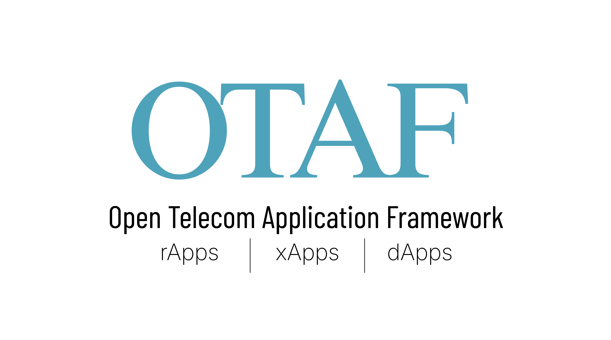

<p align="center">
  
</p>

<h1 align="center">Open Telecom Application Framework</h1>

<p align="center">
  A unified application framework for O-RAN, in Go.
</p>

One way of building, packaging and onboarding an application, across all three
control timescales.

An O-RAN application is mostly the same work every time: read configuration,
expose the endpoints the platform probes, take data in, decide something,
publish the result, and ship it as a package the platform can onboard. Only the
deciding is yours. OTAF supplies the rest.

## The three SDKs

| SDK | Application | Runs in | Timescale | Status |
| --- | --- | --- | --- | --- |
| [otaf-rapp-sdk](otaf-rapp-sdk/) | rApp — network intelligence | Non-RT RIC / SMO | ≥ 1 s | **v1.0.0** |
| [otaf-xapp-sdk](otaf-xapp-sdk/) | xApp — near-real-time RAN intelligence | Near-RT RIC | 10 ms – 1 s | planned |
| [otaf-dapp-sdk](otaf-dapp-sdk/) | dApp — real-time RAN intelligence | CU / DU | < 10 ms | planned |

Each SDK is an independent Go module, versioned and released on its own.

## Documentation

[What OTAF is and how it works](docs/) — the architecture, the layers, and how
the three application types divide the problem.

Each SDK carries its own documentation for using it.

## Using an SDK

```bash
go get github.com/coranlabs/OTAF/otaf-rapp-sdk
```

Releases are tagged per module, `otaf-rapp-sdk/v1.0.0`, so each SDK versions
independently.

## Licence

Apache 2.0. Maintained by coRAN Labs.
